🌐 言語: [日本語](README.md) | [Tiếng việt](README_VI.md)
# ✈️ PBL3\_Web – 航空券販売ウェブサイト

> 科目プロジェクト **PBL3 – ソフトウェア開発**
> ダナン大学工科大学の学生チーム
> 本システムは、ユーザーが迅速かつ便利にフライトを検索・予約・決済・管理できるように支援します。

---

## 📌 プロジェクトの目的

本プロジェクトは、オンライン航空券予約システムの構築を目的とし、以下の課題を解決します：

* 従来の予約方法では時間がかかる
* フライトスケジュールや詳細の検索が困難
* 請求書、チケット、売上管理の透明性が低い

---

## 💡 主な機能

### 🎫 ユーザー向け機能：

* 新規登録・ログイン
* 日付・出発地・目的地によるフライト検索
* 航空券の予約・座席指定
* 予約履歴の確認
* 決済と請求書の受け取り

### 🛠️ 管理者向け機能：

* 航空機の管理（CRUD）
* フライトの管理（CRUD）
* ユーザーアカウントと権限管理（Admin/User）
* 航空券の管理

---

## 🛠️ 使用技術

| コンポーネント  | 使用技術                       |
| -------- | -------------------------- |
| バックエンド   | Java Spring Boot           |
| フロントエンド  | HTML5, CSS3, 純粋なJavaScript |
| データベース   | SQL Server                 |
| ORM      | Spring Data JPA            |
| IDE      | IntelliJ IDEA              |
| プロジェクト管理 | GitHub                     |
| サポートツール  | Postman                    |

---

## システム要件

| コンポーネント | 要件バージョン                        |
| ------- | ------------------------------ |
| Java    | **JDK 22**                     |
| Maven   | **Maven 3.8以上**                |
| OS      | Windows / macOS / Linux        |
| IDE（推奨） | IntelliJ IDEA / Eclipse        |
| データベース  | **SQL Server**（Microsoft）      |
| ブラウザ    | Google Chrome / Firefox / Edge |

---

## 🚀 プロジェクト実行手順

### 1. プロジェクトをクローン

```bash
git clone https://github.com/loinguyenvan274/PBL3_Web.git
cd PBL3_Web
```

### 2. MySQL データベースを設定

* `pbl3_web` という名前のデータベースを作成
* `pbl3_web.sql` をインポート（`database/` フォルダにある、または手動でエクスポート）
* `application.properties` を以下のように更新：

```properties
spring.datasource.url=jdbc:mysql://localhost:3306/pbl3_web
spring.datasource.username=root
spring.datasource.password=your_password
```

### 3. Spring Boot アプリケーションを起動

```bash
mvn clean install
mvn spring-boot:run
```

### 4. フロントエンドを実行

```bash
npm run dev
```

### 5. Webアクセス

ブラウザで次のURLを開く： [http://localhost:5173/](http://localhost:5173/)

---

## 🖼️ 画面例（スクリーンショット）

### 管理者用画面

| ページ名    | 画像                          |
| ------- | --------------------------- |
| ホーム     | 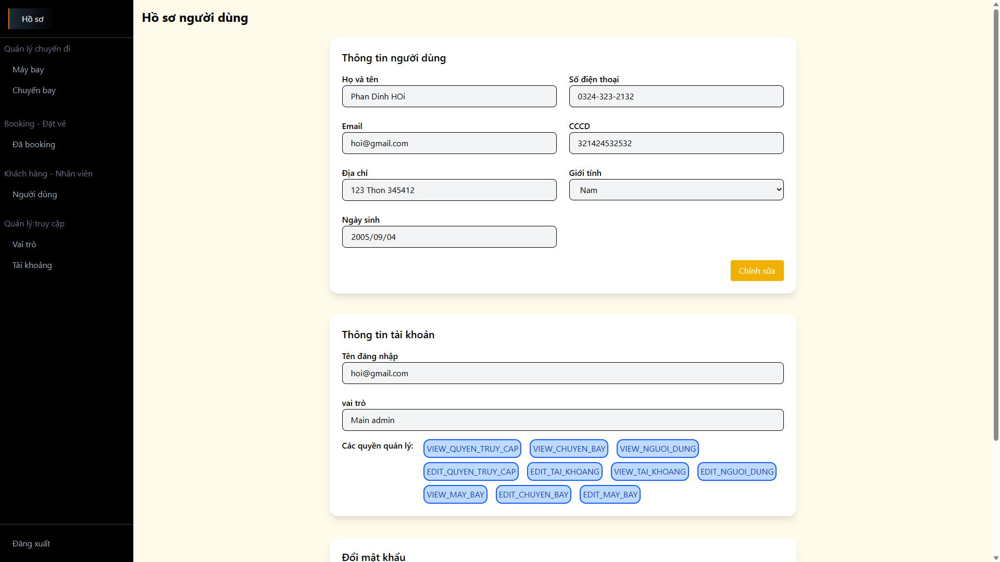   |
| 航空機管理   | 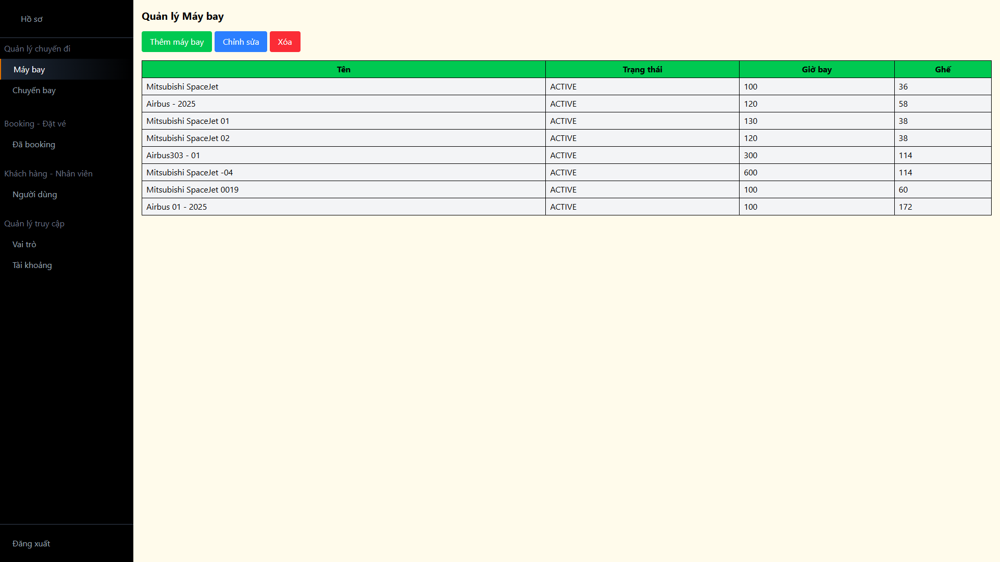    |
| 座席マップ   | 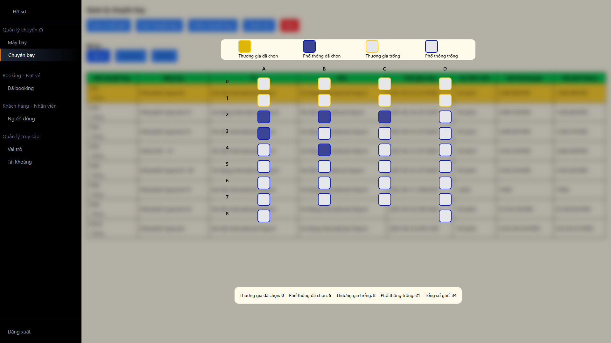    |
| フライト情報  | 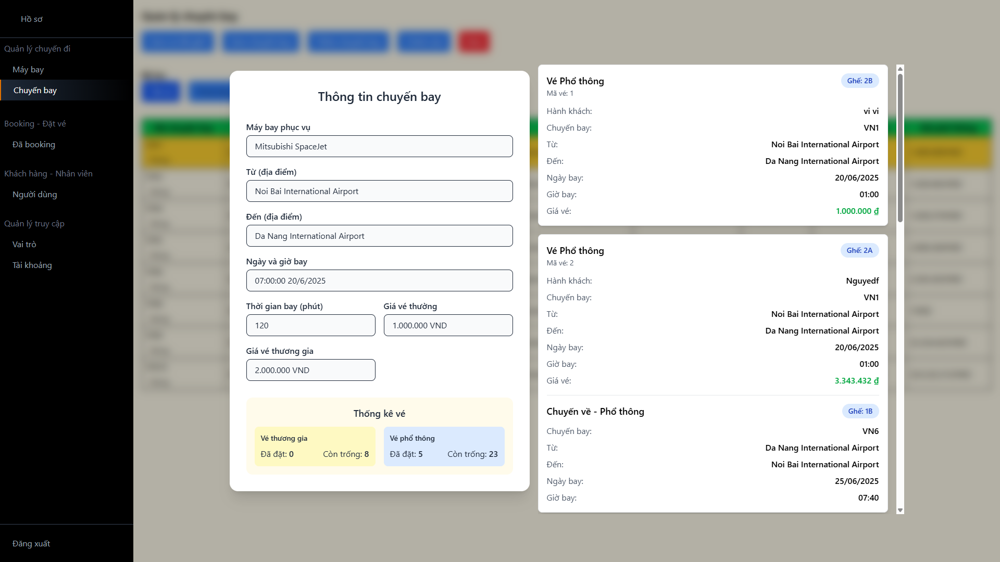    |
| 予約一覧    | 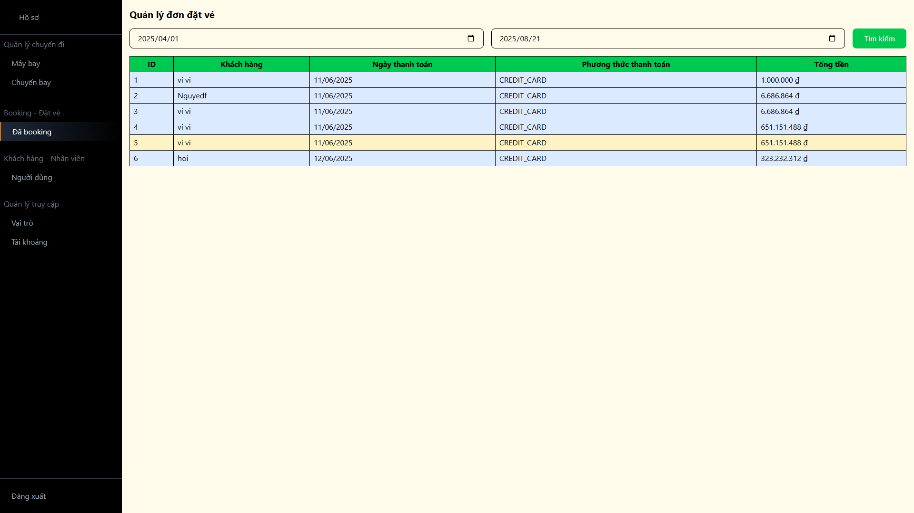    |
| チケット詳細  | 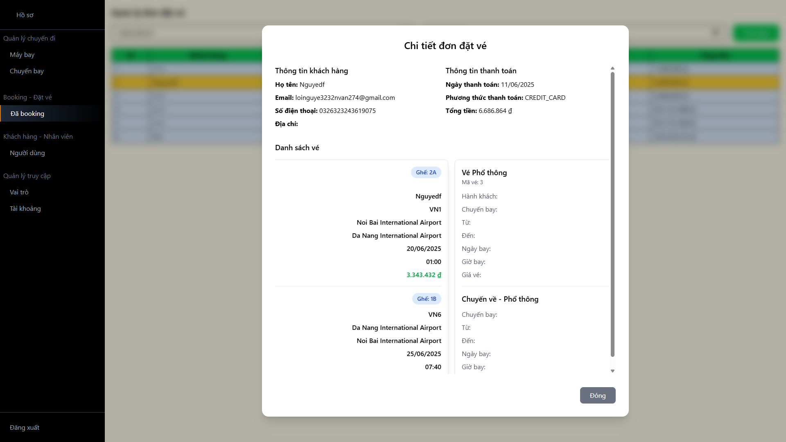    |
| 顧客情報    | 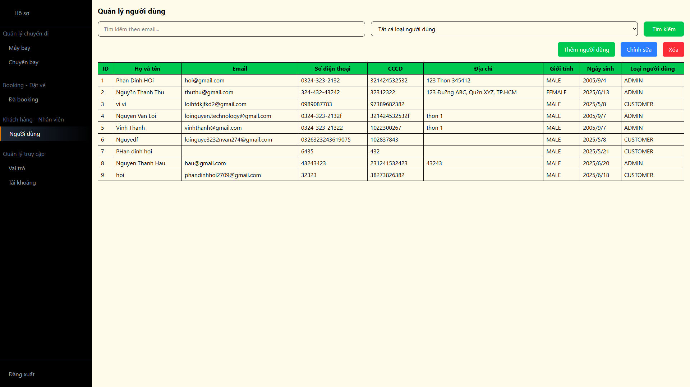    |
| 権限管理    | 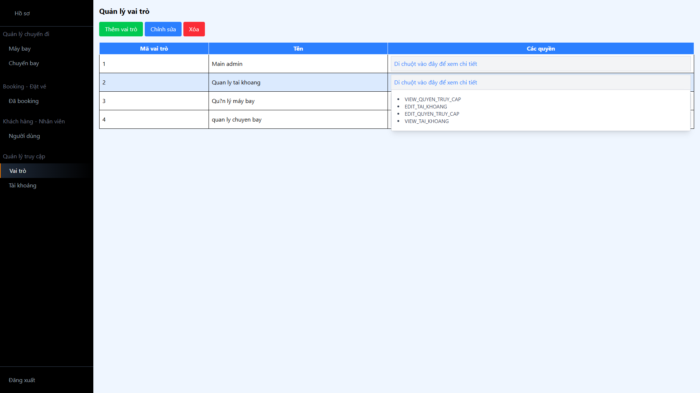    |
| アカウント管理 | 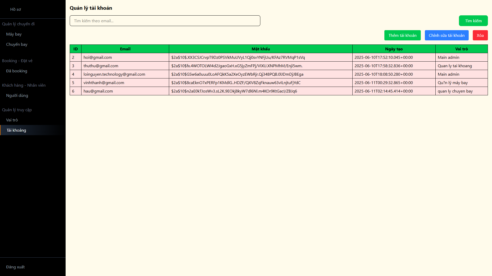 |

### 顧客用画面

| ページ名     | 画像                         |
| -------- | -------------------------- |
| ホーム      | 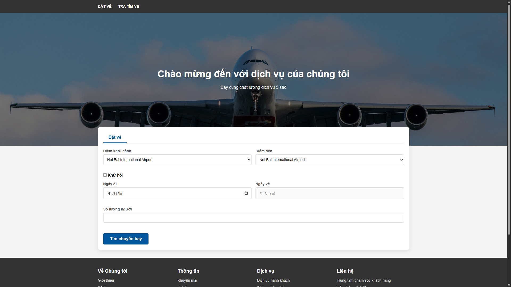 |
| フライト検索結果 | 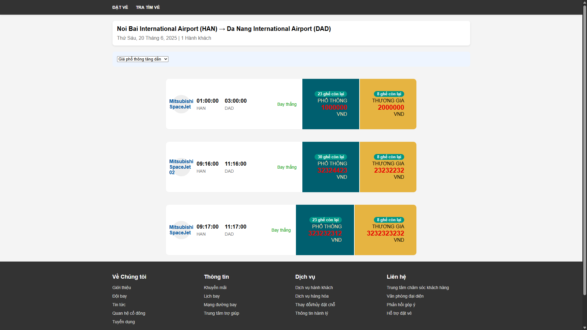  |
| 座席選択ページ  | 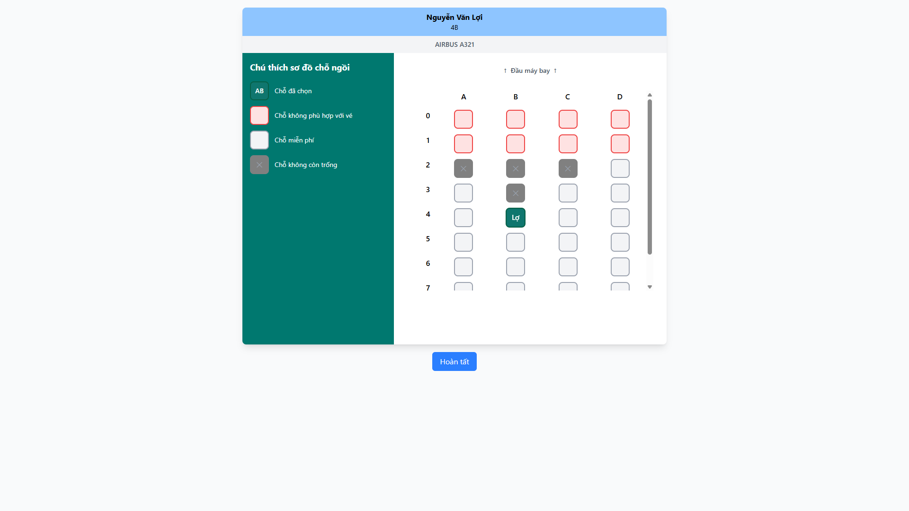  |

---

## 🔐 ユーザー権限

| 役割    | 権限                   |
| ----- | -------------------- |
| User  | フライト検索、予約、チケット確認     |
| Admin | 航空機・フライト・ユーザー管理、統計表示 |

---

## 📂 ディレクトリ構成

```bash
PBL3_Web/
├── src/
│   ├── main/
│   │   ├── java/com/pbl3/
│   │   │   ├── controller/
│   │   │   ├── entity/
│   │   │   ├── repository/
│   │   │   ├── service/
│   │   │   └── Pbl3WebApplication.java
│   │   └── resources/
│   │       ├── templates/
│   │       ├── static/
│   │       └── application.properties
├── README.md
└── pom.xml
```

---

## ❗ 注意事項

* このプロジェクトは学習目的で作成されており、商用利用は想定していません。
* 一部の決済機能はデモ用であり、実際の決済ゲートウェイには接続していません。

---

## ❤️ こだわりポイント

本システムの開発において、特に力を入れたのは「座席選択」機能です。これは単なる付加機能ではなく、ユーザーにリアルでプロフェッショナルな体験を提供するための中核的な要素です。

### なぜ重要なのか？

ランダムな座席指定ではなく、ユーザー自身が希望する席を選択できるようにすることで、実際の航空券予約サービスに近い体験を提供します。窓側、非常口付近、予約済み席の回避など、細かな要望にも応えることができます。

### 実装方法

JavaScriptでインタラクティブな座席マップを設計。各座席には状態が示されます：

✅ 選択可能
❌ 予約済み
🔒 利用不可

選択された座席はリアルタイムでデータベースに登録され、サーバーとクライアント双方で重複防止のチェックを実施。

### 課題と解決策

| 課題                     | 解決策                             |
| ---------------------- | ------------------------------- |
| 複数ユーザーによる同時選択時の状態同期    | 座席状態を確認後に予約を確定するロジックを実装         |
| ITに不慣れなユーザーでも使える直感的なUI | 実際の機内レイアウトを模したシンプルで分かりやすいデザインに  |
| データの安全性確保              | DBの制約・バリデーション・認証処理を実装し、正確な保存を保証 |

---

## 🧑‍💻 チームメンバー

| 氏名               | 担当                |
| ---------------- | ----------------- |
| Nguyễn Văn Lợi   | バックエンド、フロントエンド    |
| Nguyễn Thanh Hậu | フロントエンド、UI設計、DB構築 |

---

## 📄 ライセンス

© 2025 – PBL3チーム – ダナン大学工科大学
